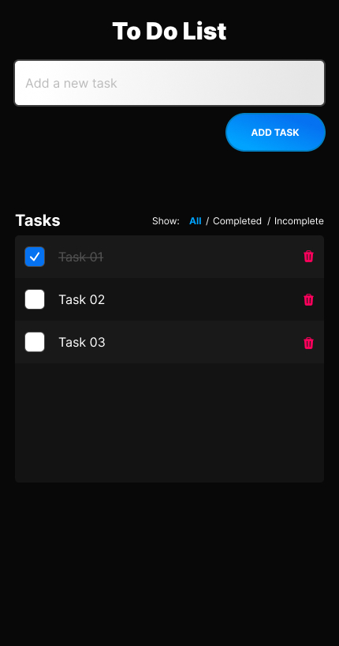

# Take-Home Interview Assignment for QA Engineer

## Objective

This assignment is designed to assess your skills in quality assurance, attention to detail. Optionally, you have the chance to show off your ability to write end-to-end tests.

You will be provided with a simple React application along with its specifications. Your task is to test the application, identify any discrepancies between the implemented functionality and the specifications, and write a report on your findings.

Additionally, you can opt to implement a couple of basic end-to-end tests for the application.

## Application Overview

The application is a simple Todo List built with React. It allows users to add, delete, and mark tasks as complete.

The UI is straightforward, consisting of an input field to add new tasks, a list of tasks displaying added tasks with options to mark them as complete or delete them, and a filter feature to view all tasks, only completed tasks, or incomplete tasks.



### Expected Functionality

1. Adding Tasks
    * Users can add tasks using the input field at the top.
    * Pressing the "Enter" key or clicking the "Add Task" button adds the task to the list.
    * The input field should clear upon adding the task.

2. Displaying Tasks
    * Tasks should be listed below the input field.
    * Each task should have a checkbox to mark it as complete, a task description, and a delete button.

3. Marking Tasks as Complete
    * Clicking the checkbox next to a task marks it as complete.
    * Completed tasks should display with a ~~strikethrough~~ effect on the text.

4. Deleting Tasks
    * Clicking the delete button next to a task removes it from the list.

5. Filtering Tasks
    * Users can filter tasks to show;
      * all tasks,
      * only completed tasks,
      * or only incomplete tasks.

### Differences in Implementation

Minor differences have been intentionally introduced in the application's implementation from the above specifications. Identify and document these differences in your test report.

## Assignment Tasks

### Required

1. Test the Application

    **This is the most important part of the assignment.**

    * Thoroughly test the application based on the provided specifications.
    * Identify any discrepancies between the application's functionality and the specifications.
    * Document your findings in a test report, including any bugs or unexpected behavior you observe.

### Optional, bonus

1. Write End-to-End Tests

    Writing End-to-End Tests is **optional**. However, it is _a bonus_ to your submission.

    * Set up a basic end-to-end test environment in the project. Suggestions include but are not limited;
        * TestCafe
        * Playwright
        * Cypress
        * Codecept
        * Any other E2E library of your choice
    * If you opt to write end-to-end tests. Here are a couple of suggested test cases to start with;
        * A test to verify that a user can add a task.
        * A test to verify that a user can delete a task.
        * Feel free to add more tests as you see relevant based on your findings.

## Getting Started

### Prerequisites

1. Install project dependencies
    * [node & npm](https://nodejs.org/en)
        * [via a package manager](https://nodejs.org/en/download/package-manager)

### Setup Instructions

1. Clone the repository from [GitHub](https://github.com/scarf-sh/qa-eng-take-home).
2. Install dependencies

    ```bash
    npm install
    ```

3. Run the development server

    ```bash
    npm run dev
    ```

4. Open [http://localhost:3000](http://localhost:3000) with your browser to see the result.
